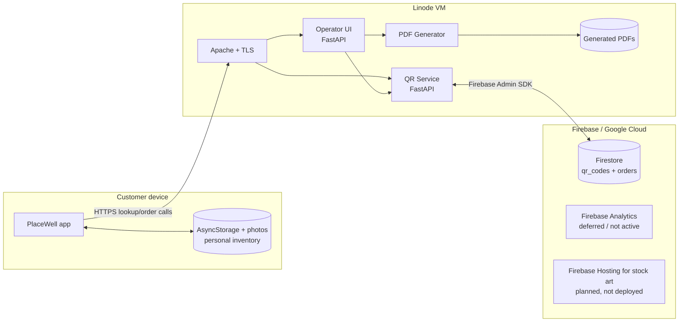
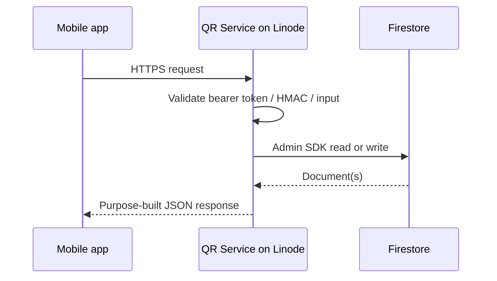
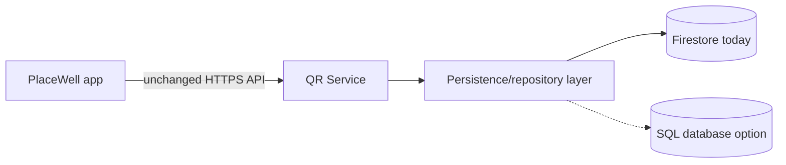

# Firebase, Linode and SQL Storage Decision

**Decision date:** August 2026  
**Current recommendation:** Keep issued QR-label metadata in Firestore. Do not move it to self-managed SQL Server on the existing Linode. If relational requirements eventually justify migration, prefer a managed PostgreSQL service behind the existing QR Service API.

## 1. Important terminology correction

PlaceWell has two different kinds of "label data":

| Data type | Examples | Current storage |
|---|---|---|
| **Issued physical-label metadata** | Random label ID, order ID, printed name, category, SKU, image key, active/revoked status, scan counters | Firestore |
| **Customer's configured inventory** | User-entered label name, contents, notes, room, zone, freshness dates, attached photo | Mobile device only (`AsyncStorage` and local photo URI) |

The customer's configured inventory is **not currently stored in Firebase**. Moving the two Firestore collections would move the issued-label registry and order metadata, not the user's personal inventory.

## 2. What is hosted where today



PNG fallback: [open hosting boundary diagram](diagrams/hosting-boundary.png)

### Linode production responsibilities

| Component | Current responsibility |
|---|---|
| Apache | Public TLS termination, reverse proxy, protected `/ui` routing |
| PlaceWellQRService | QR allocation, label/order lookup, scan landing pages, deep-link fallback, scan counters |
| PlaceWellUI | Password-protected order form and orchestration |
| PlaceWellPdfGenerator | Called by the UI process to generate label and manifest PDFs |
| Linode filesystem | Deployed code, environment files, Firebase service-account key, generated PDFs and logs |
| systemd/firewalld/Certbot | Process supervision, firewall and certificate renewal |

### Firebase / Google Cloud responsibilities

| Service | Current state | Responsibility |
|---|---|---|
| Cloud Firestore | **Active** | `qr_codes` and `orders` collections |
| Firebase Admin SDK | **Active on Linode** | Authenticates the QR Service to Firestore |
| Firebase Analytics | **Deferred** | Wrapper exists, but production package/config activation is deferred until an Expo SDK upgrade |
| Firebase Hosting | **Planned only** | Selected in the stock-image implementation plan for future static image delivery; not part of today's runtime |
| Firebase Authentication | **Not used** | No PlaceWell user accounts exist today |

External but separate services include Namecheap DNS, Let's Encrypt certificates, Expo/EAS builds, Apple App Store and Google Play.

## 3. How Firestore is used today

The mobile app never accesses Firestore directly:



PNG fallback: [open Firestore API boundary diagram](diagrams/firestore-api-boundary.png)

The current Firestore workload is simple:

- point lookup by six-character label document ID;
- query active labels by `order_id`;
- atomic creation of all label records and the order summary;
- atomic scan-counter increments;
- server-generated timestamps;
- active/revoked status resolution.

This is a good match for a document database. PlaceWell does not currently need complex joins to serve a scan.

## 4. Could the Firestore data move to SQL Server on Linode?

**Technically, yes.** The API boundary is already correct, so the mobile app should not need to know which database the QR Service uses.



PNG fallback: [open database abstraction diagram](diagrams/database-abstraction.png)

A relational model could look like:

```text
orders
  order_id PK
  content_category
  username_prefix
  status
  created_at
  schema_version

qr_codes
  label_id PK
  order_id FK -> orders.order_id
  item_id
  label_name
  category
  label_sku
  image_key
  status
  is_blank
  is_order_qr
  defaults...
  scan counters...
  created_at

order_summary fields
  either normalized child tables or JSON columns, depending on reporting needs
```

The QR Service would replace Firebase Admin calls with a SQL repository using parameterized queries and transactions. The app must **never connect directly to SQL**: database credentials embedded in an IPA/APK can be extracted, and a raw database connection provides no safe per-request authorization, rate limiting or business-logic boundary.

## 5. What PlaceWell gets from Firestore today

### Benefits currently used

1. **No database server operations.** Google handles patching, availability, capacity and routine platform maintenance.
2. **Simple scale-to-use model.** The small label registry can operate within Firestore's free quota; billing scales by storage and operations rather than a continuously provisioned database VM.
3. **Atomic batch allocation.** The QR Service creates all label documents plus the order document together, preventing partially allocated orders.
4. **Atomic counters and server timestamps.** Scan metrics are concurrency-safe without application-side locking.
5. **Fast key/document access.** The dominant request is a label-ID lookup, which fits Firestore well.
6. **Independent failure boundary.** The database is not on the same VM as Apache and both Python services.
7. **Managed recovery features.** Firestore supports PITR, scheduled backups and database delete protection when configured.

### Benefits available later, but not currently used

Firestore's mobile offline persistence, real-time listeners and Firebase Authentication integration are legitimate platform capabilities, but **PlaceWell does not receive those benefits today** because the app uses `AsyncStorage` and only the Linode QR Service accesses Firestore.

They become relevant only if a future cloud-sync/account design connects authenticated clients to Firebase or adds equivalent sync APIs. They should not be used as the primary justification for today's database choice.

### Drawbacks

- Firestore-specific APIs and document modeling create vendor coupling.
- There are no database-enforced foreign keys between `orders` and `qr_codes`.
- Complex joins, ad-hoc reporting and relational constraints are less natural than in SQL.
- Read/write/storage billing can become material at much larger scale.
- PITR and managed backups require billing and explicit activation.
- A service-account credential currently exists on the Linode and must be tightly protected and rotated.

## 6. Firestore versus SQL Server on the current Linode

| Dimension | Firestore | Self-managed SQL Server on Linode |
|---|---|---|
| Current code fit | Already implemented | QR Service persistence rewrite required |
| Operations | Managed/serverless | PlaceWell owns installation, patching, monitoring and upgrades |
| Backups/PITR | Managed features available | Must design, automate, store off-server and repeatedly test |
| High availability | Managed by Google | Not provided by one VM |
| Failure isolation | Separate from Linode | Web/API/database fail together if the VM fails |
| Relational queries | Limited compared with SQL | Strong joins, constraints and reporting |
| Schema enforcement | Application/document conventions | Strong database constraints |
| Small-scale cost | Often within free quota | VM/storage plus possible SQL Server licensing |
| Scaling | Automatic | Capacity planning, connection management and vertical/horizontal changes |
| Mobile offline/realtime | Available only through Firebase client architecture | Not built in; custom sync/push layer required |
| Portability | Firestore-specific | Better data portability, although T-SQL features can add Microsoft coupling |

### SQL Server-specific concerns

- Akamai/Linode's managed database offering supports managed relational engines such as PostgreSQL/MySQL, but SQL Server would be self-managed on a VM.
- SQL Server Developer edition cannot be used for production. Express can be used without a license fee but has resource/feature limits and is a poor foundation for a service expected to grow.
- Paid SQL Server editions use Microsoft licensing rules in addition to VM cost.
- Placing SQL Server on the existing small production VM increases contention and creates a single failure domain for the website, APIs and database.
- A second database VM improves isolation but adds cost and still leaves PlaceWell responsible for database operations and recovery.

SQL Server would make sense only if PlaceWell had a real Microsoft-specific requirement or existing operational expertise/infrastructure that outweighed these costs. No such requirement exists in the current system.

## 7. Better relational alternative: managed PostgreSQL

If PlaceWell eventually needs SQL, managed PostgreSQL is a better target than SQL Server:

- no proprietary database license;
- standard relational constraints, joins and transactions;
- mature Python support through SQLAlchemy and PostgreSQL drivers;
- portable dumps and broad hosting choices;
- managed backups, maintenance and high-availability options from multiple providers;
- lower operational burden than a self-managed SQL Server VM.

This does not mean PlaceWell should migrate now. It identifies the preferred destination if relational requirements become concrete.

## 8. Decision matrix for PlaceWell

| Requirement | Best fit |
|---|---|
| Current QR allocation and keyed lookup | Firestore |
| Minimal operations for a small team | Firestore |
| Future Firebase-native accounts/realtime sync | Firestore |
| Complex joins and cross-order operational reporting | PostgreSQL |
| Strict relational integrity across users/orders/labels | PostgreSQL |
| Microsoft-only reporting/integration dependency | SQL Server |
| Lowest-risk choice before launch and early growth | Firestore |

## 9. Recommendation

### Now

1. **Keep `qr_codes` and `orders` in Firestore.**
2. **Do not install SQL Server on the current Linode.**
3. Complete the existing Firestore DR todo: enable PITR, daily/weekly scheduled backups and delete protection, then perform a restore drill.
4. Keep an independent copy of allocation results/PDFs so printed IDs can be reconstructed if the Firebase project is lost.
5. Introduce a small persistence/repository interface inside the QR Service when the next substantial data-layer change is made. This reduces future migration coupling without changing behavior now.

### Re-evaluate when one of these triggers occurs

- reporting requires repeated cross-entity joins that Firestore cannot serve cleanly;
- user accounts/cloud sync introduce a relational ownership model;
- Firestore operating cost becomes consistently higher than a managed SQL service;
- regulatory/data-residency needs demand a different platform;
- vendor concentration becomes a business priority;
- a measured reliability or performance issue is attributable to Firestore.

### If a trigger occurs

Run a managed PostgreSQL proof of concept behind the QR Service:

1. define normalized schema and constraints;
2. add a repository abstraction;
3. export and transform Firestore records;
4. dual-write allocations to both databases;
5. compare counts, hashes and API responses;
6. switch reads gradually;
7. retain Firestore read-only through a rollback window;
8. remove it only after restore and rollback drills succeed.

No mobile release should be required if the public API contract remains unchanged.

## 10. Bottom line

Firestore is not being used as a general cloud database for customers' personal inventories. It is a managed registry for issued physical QR labels and orders, and it currently fits that job well.

Moving that registry to SQL is possible, but self-managed SQL Server on Linode would trade a small amount of vendor independence and stronger relational querying for substantially more operational work, licensing considerations and a larger outage blast radius. There is no current product requirement that justifies that trade.

**Recommended architecture:** Firestore now; managed PostgreSQL later only if measurable relational needs appear; no direct mobile-to-SQL connection at any stage.

## 11. Vendor references

- [Firestore pricing and free quota](https://firebase.google.com/docs/firestore/pricing)
- [Firestore quotas and limits](https://firebase.google.com/docs/firestore/quotas)
- [Firestore offline data](https://firebase.google.com/docs/firestore/manage-data/enable-offline)
- [Firestore realtime listeners](https://firebase.google.com/docs/firestore/query-data/listen)
- [Firestore Security Rules and Firebase Authentication](https://firebase.google.com/docs/rules/rules-and-auth)
- [Firestore point-in-time recovery](https://cloud.google.com/firestore/docs/pitr)
- [Firestore scheduled backups](https://cloud.google.com/firestore/docs/backups)
- [Akamai managed databases](https://techdocs.akamai.com/cloud-computing/docs/aiven-database-clusters)
- [Akamai database engines and plans](https://techdocs.akamai.com/cloud-computing/docs/database-engines-plans)
- [Microsoft SQL Server editions and supported features on Linux](https://learn.microsoft.com/en-us/sql/linux/sql-server-linux-editions-and-components-2025)
- [Microsoft SQL Server licensing guidance for Linux](https://learn.microsoft.com/en-us/troubleshoot/sql/linux/choosing-licensing-model-using-mssql-conf)
- [React Native security guidance](https://reactnative.dev/docs/security)
