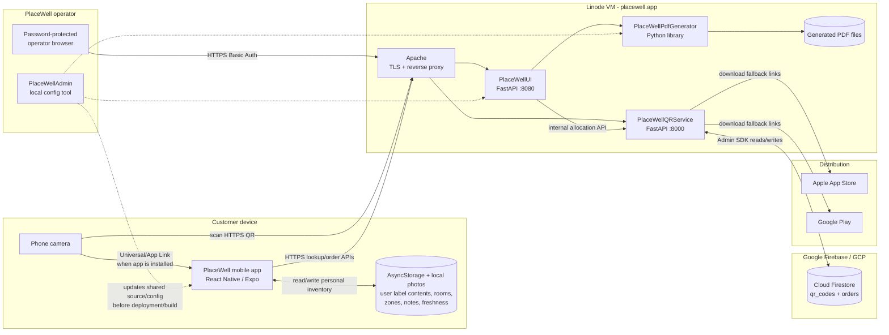
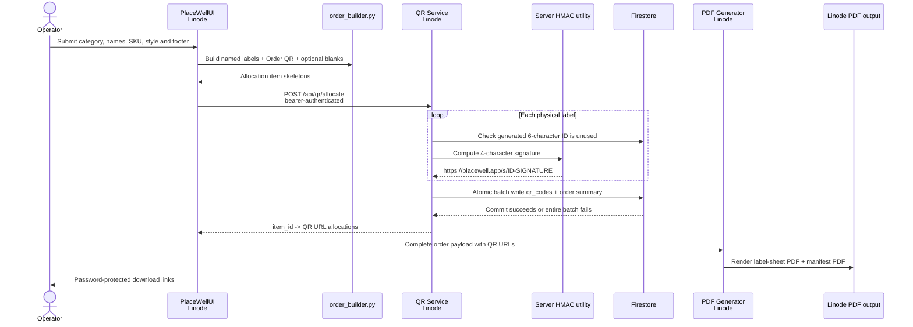
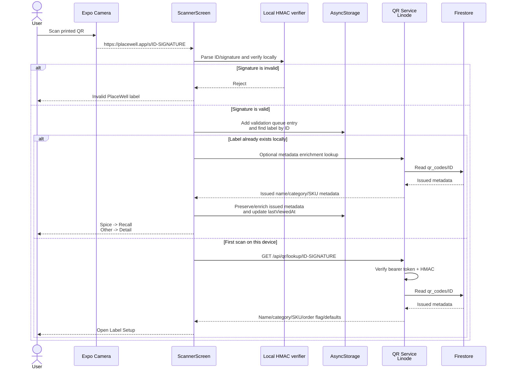
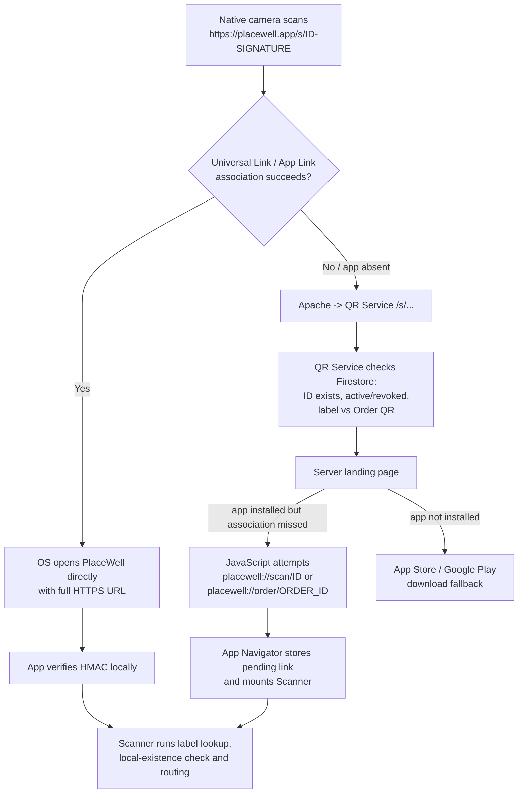
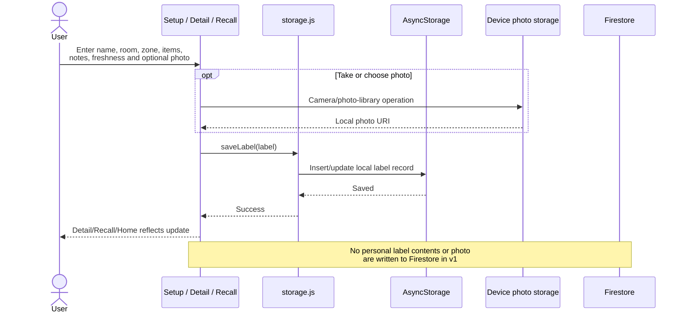
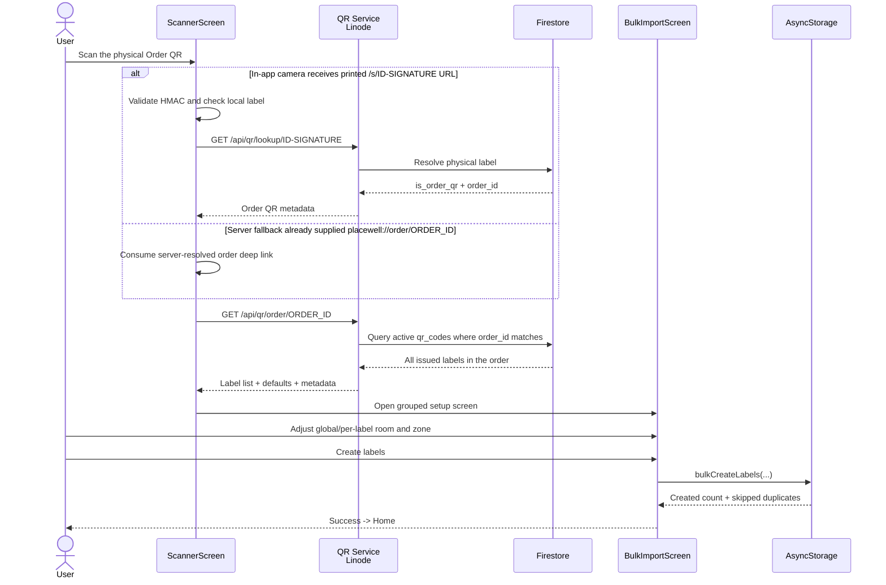
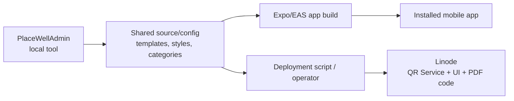

# PlaceWell Visual Architecture and Call Flows

This document shows the implemented PlaceWell architecture as of August 2026. It separates what runs on the phone, what is hosted on Linode, what is stored in Firebase/Firestore, and what runs only as internal operator tooling.

## 1. System boundary map

### What is and is not in Firestore

| Data | Current location | Sent to Firestore? |
|---|---|---|
| Issued label ID, order ID, printed name, category, SKU, image key, status, scan counters | Firestore through QR Service | Yes |
| Order allocation summary | Firestore through QR Service | Yes |
| User-entered contents, notes, room, zone, freshness dates | Mobile `AsyncStorage` | No |
| User photos attached to labels | Mobile device/app storage | No |
| Generated label and manifest PDFs | Linode filesystem | No |
| Category/template/style source configuration | Source repositories and UI CSV files | No |

The mobile app does **not** connect directly to Firestore. All server metadata access goes through the QR Service on Linode.

## 2. Producing a physical label order

**Important behavior**

- HMAC is generated by the QR Service, not by the operator UI.
- Firestore allocation is atomic: an order does not partially claim label IDs.
- The PDF embeds the signed HTTPS URL. It does not query Firestore.
- PlaceWellAdmin is not in the live request path; it updates shared configuration used by later builds/deployments.

## 3. In-app camera scan of one label

**Failure behavior:** the initial authenticity check works offline. If the later metadata lookup fails, the app can continue with the name encoded in the QR URL or with empty/default setup fields. Firestore never receives the user's personal label contents.

## 4. Scan with the phone's native camera

The first hop depends on whether iOS/Android successfully associates `placewell.app` with the installed app.

### Trust distinction

- **Direct HTTPS App/Universal Link:** the app still has `ID-SIGNATURE`, so it verifies HMAC locally.
- **Server fallback custom link:** the QR Service first resolves the ID in Firestore, then sends `placewell://scan/ID` without the signature. The app marks this path as server-validated and does not repeat HMAC verification.
- The public `/s/` page determines active/revoked/not-found state from Firestore and records a best-effort camera scan count.

## 5. Saving, recalling and editing a label

An existing label is routed locally:

- `category === "spice"` -> `LabelRecall`
- every other category -> `LabelDetail`
- edit/save updates the same local record and preserves immutable issued metadata such as physical SKU and printed-name information.

## 6. Order QR bulk import

Firestore is read to reconstruct what was physically issued in the order. The imported, user-configured copies are then stored locally on that device.

## 7. Configuration and deployment flow

This is a build/deployment flow, not a runtime API flow. A configuration change reaches customers only after the affected app is rebuilt or the affected Linode service is deployed.

## 8. Runtime ownership summary

| Capability | Primary component | Supporting systems |
|---|---|---|
| QR authenticity for in-app scan | Mobile HMAC verifier | Signed URL generated by QR Service |
| Public scan landing/download page | QR Service on Linode | Apache, Firestore |
| Label metadata lookup | QR Service on Linode | Firestore |
| Personal inventory CRUD/search | Mobile app | AsyncStorage/device photos |
| Order QR bulk import | Mobile app + QR Service | Firestore, AsyncStorage |
| QR ID allocation | QR Service on Linode | Firestore atomic batch, HMAC |
| Order form | PlaceWellUI on Linode | Apache Basic Auth |
| Label/manifest rendering | PDF Generator on Linode | UI order payload, Linode filesystem |
| Shared category/template maintenance | PlaceWellAdmin locally | Source repositories |

## 9. Key architectural consequences

1. **Linode availability affects online metadata and order import, not already-saved local labels.**
2. **Firestore availability affects allocation, lookup, public scan resolution and bulk import.**
3. **A user can open and edit locally saved labels without Firestore.**
4. **A first-time label scan can pass local HMAC validation even if lookup is temporarily unavailable, but may have less issued metadata.**
5. **Deleting Firestore allocation records is serious:** physical QR codes cannot be reissued with different random IDs, which is why backups and retained allocation artifacts matter.
6. **Moving Firestore later changes the QR Service persistence layer; the app should continue to call the API rather than connect directly to any database.**
